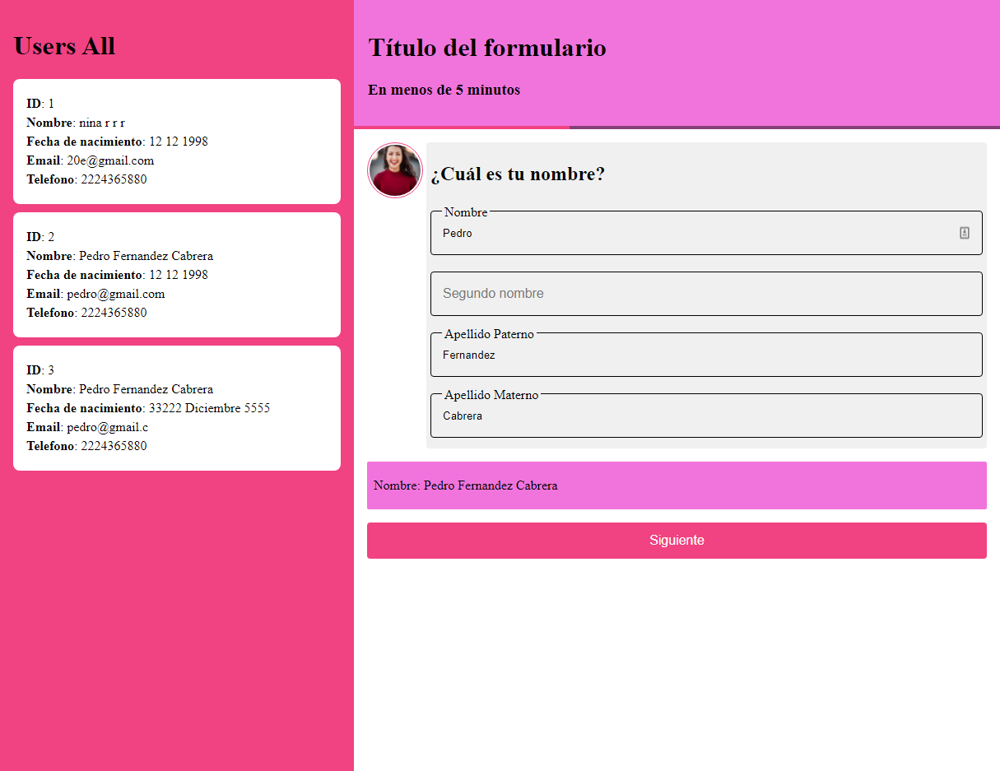

## Ali Challenge 

Generar el siguiente formulario en forma de chat construido con componentes
independientes, uno para nombre, uno fecha de nacimiento y por último otro para
datos de contacto, al responder cada una de las preguntas deberá mostrar un
recuadro rosa con la información capturada, al finalizar el usuario deberá
presionar el botón “Iniciar”, cada uno de los datos deberá mostrar en un recuadro
al final con la información capturada como se muestra y almacenar los datos en
variables de sesión.

Puedes utilizar las React JS y styled-component o bootstrap.

Generar un proyecto independiente para el API donde se tiene que enviar los datos
capturados y guardar en una base de datos mysql. Los request de las peticiones
debe de guardar en la tabla usuarios los datos:

- Nombre
- Segundo Nombre
- Apellido Paterno
- Apellido Materno
- Fecha de Nacimiento
- Email
- Teléfono

### Algunas capturas del resultado.

  

URL 👉👉 graphql-form.herokuapp.com/graphql

URL del GraphQL 👉👉 graphql-form.herokuapp.com/graphql